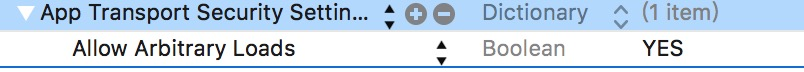

----
##0x01 模块的基本描述
此模块用于支持iOS客户端的登录业务。。。巴拉巴拉一大堆

----
##0x02 info.plist 额外配置

- 
> 用于适配iOS9网络请求将统一使用TLS 1.2 SSL，YES 表示可以回退到支持Http请求，NO 表示应用中所有请求必须通过Https方式请求

``` xml
  <key>NSHumanReadableCopyright</key>
	<string>Copyright © 2016年 _Finder丶Tiwk. All rights reserved.</string>
```
> 用于显示版权信息

- Bundle display name ： 登录模块
> 用于显示应用名称

----

##0x03 使用注意事项
**请看XKSLoginServices中所有暴露的接口**

----
##0x04 依赖的其它库

### 使用到的第三方库

- MBProgressHUD (0.9.2)
> 用于登录时显示等待菊花


### 使用到的内部私有库

- XKSCommonSDK
